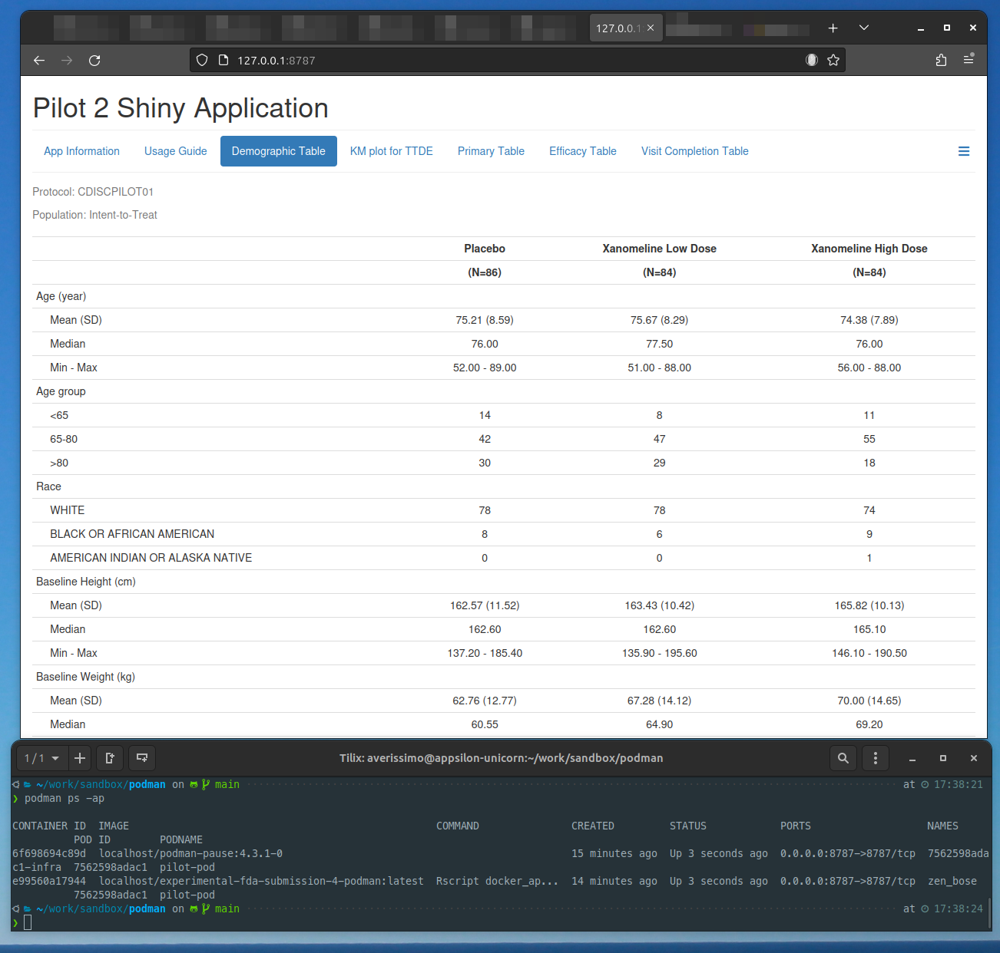

# Podman FDA Submission Pilot 4

Proof of concept by [Appsilon](https://appsilon.com/) based on [Pilot 2](https://github.com/RConsortium/submissions-pilot2/).

## Requirements

[Install Podman](https://podman.io/docs/installation) locally _(in Ubuntu it can be installed via `sudo apt install qemu-system podman podman-compose -y.`)_

🟡 There is no need to configure registries to use this Dockerfile as it will pull from `docker.io` by default.

However, this image supports alternative image registry, see section bellow [Using GitHub Container Registry](#using-github-container-registry).

Download / clone the repository

```
$ git clone --recurse-submodules https://github.com/Appsilon/experimental-fda-submission-4-podman
$ cd experimental-fda-submission-4-podman
```

## Run the container locally

There are 2 methods to run the container:

1. Creating and running a container via `podman`
1. With `podman-compose` and a valid `docker-compose.yml` configuration _(🟡 it may not be installed by default with podman)_

### Run the container with podman

After running the container, the Teal application is available at `http://localhost:8787`.

```bash
$ podman machine init
$ podman build . --tag experimental-fda-submission-4-podman
$ podman pod create --publish 8787:8787 pilot-pod
$ podman run -dt --pod pilot-pod experimental-fda-submission-4-podman:latest
```

### Run the container with podman-compose

After running the container, the Teal application is available at `http://localhost:8787`.

```bash
$ podman-compose up -d --pull
```

### Using GitHub Container Registry

The user can use a different container registry from the default `docker.io` by changing the `BUILD ARGS` of the docker image. It needs to change the `IMAGE_REGISTRY=ghrc.io` and `IMAGE_ORG=rocker-org` to appropriate values. The organization also needs to change as it has different usernames in `docker.io` (rocker) and `ghrc.io` (rocker-org).

This can be achieved in 3 different ways:

1. Running podman via command line
2. Edit the `Dockerfile` file
3. Edit the `docker-compose.yml` file

1\. To build the image in the command line by running:

```bash
$ podman build . --build-arg IMAGE_REGISTRY=ghrc.io --build-arg IMAGE_ORG=rocker-arg --tag experimental-fda-submission-4-podman
```

2\. Edit the `Dockerfile` file by changing the following ARGS:

```
# ...
ARG IMAGE_REGISTRY=docker.io
ARG IMAGE_ORG=rocker
# ...

# build the image by running:
# $ podman build . --tag experimental-fda-submission-4-podman
```

3\. Edit the `docker-compose.yml` by changing the `service.pilot-4-podman.build.args`:

ℹ️ note: This can be done by changing the existing example in `docker-compose.yml` or creating a new service with the different registry.

```
# edit the lines below
# ...
  build:
    context: .
    args:
      IMAGE_ORG: rocker
      IMAGE_REGISTRY: docker.io
# ...

# build the image using podman-compose by running:
# $ podman-compose build --pull pilot-4-podman
```

## Screenshot of the Pilot running


